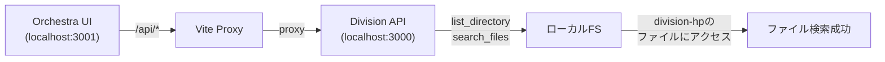

# ローカルAPI起動によるファイルサーチ対応

## 現状のアーキテクチャ



既に **Viteプロキシ** が `localhost:3001/api/*` を `localhost:3000` に転送する設定になっている。つまりフロントの変更は不要で、**APIをローカルで起動するだけ**で動く。

## 必要な手順

### 1. 環境変数の準備

`.env.example` をコピーして `.env` を作成し、以下を設定:

- `DATABASE_URL` / `DIRECT_URL` (Supabase PostgreSQL)
- `OPENAI_API_KEY`, `ANTHROPIC_API_KEY`, `GOOGLE_API_KEY`, `PERPLEXITY_API_KEY` 等
- `PORT=3000`

既にVercelに設定済みの環境変数と同じ値を使えばよい。

### 2. APIをローカルで起動

```bash
cd /Volumes/T7/Program/Division
npm run dev   # ts-node src/index.ts → localhost:3000
```

[src/index.ts](src/index.ts) で `process.env.VERCEL` がない場合に `app.listen(PORT)` する。

### 3. フロントをローカルで起動

```bash
cd /Volumes/T7/Program/Division/frontend
npm run dev   # vite → localhost:3001
```

[frontend/vite.config.ts](frontend/vite.config.ts) のプロキシ設定で `/api` が `localhost:3000` に転送される。フロントの `API_BASE = '/api'` は変更不要。

### 4. workspacePath をリクエストに含める（コード変更1箇所）

Orchestra UIからAPIを呼ぶときに `workspacePath` を送る必要がある。
[frontend/src/hooks/useOrchestrator.ts](frontend/src/hooks/useOrchestrator.ts) の `runOrchestration` で `workspacePath` を渡せるようにする:

```typescript
// useOrchestrator.ts 29行目
body: JSON.stringify({ projectId, input, overrides, workspacePath }),
```

`workspacePath` はOrchestra UIの設定画面やプロジェクト設定で指定するか、入力時に渡す形にする。

### 5. workspacePath をどこから取得するか

Orchestra UIはブラウザで動くので、直接ファイルパスは取得できない。以下のいずれか:

- **A. プロジェクト設定にワークスペースパスを保存** - `orchestraStore` にプロジェクトごとの `workspacePath` を持たせ、ユーザーが入力する
- **B. URLパラメータで渡す** - `?workspace=/Volumes/T7/Program/division-hp` のように指定
- **C. agents.json に追記** - `division-hp/.division/agents.json` に `"workspacePath": "/Volumes/T7/Program/division-hp"` を追加し、フロントから読む

## まとめ

- フロントの接続先変更は**不要**（Viteプロキシが既にlocalhost:3000を向いている）
- API起動は `npm run dev` だけ
- 唯一のコード変更は `useOrchestrator.ts` で `workspacePath` を送る部分
- ファイルサーチが `workspacePath` を使ってローカルの `division-hp` のファイルに直接アクセスできるようになる
